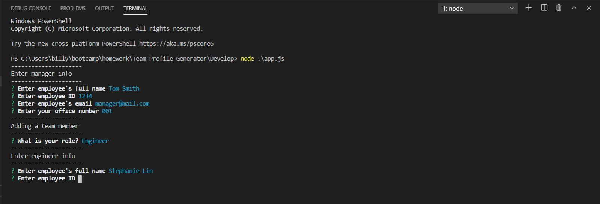

# Team Profile Generator

## Description

This application generates an HTML page of a business's team members and key information about those members.

## Table of Contents

* [Installation](#installation)
* [Usage](#usage)
* [Credits](#credits)
* [License](#license)
* [Contributing](#contributing)
* [Tests](#tests)
* [Questions](#questions)

## Installation

Run this application using Node.js.

## Usage

After running app.js from the Develop directory, answer a series of prompts to generate the HTML file.

Screenshot of the Node application:

A successfully generated HTML file:

## Credits

Developed with support from the University of Washington's Coding Boot Camp.

## License

## Contributing

## Questions

Email me at <billyhao12@gmail.com>
